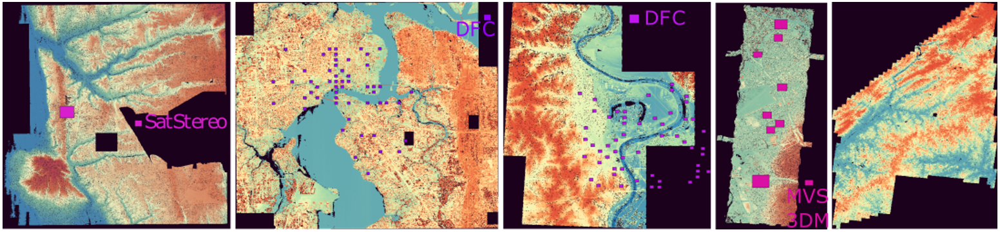
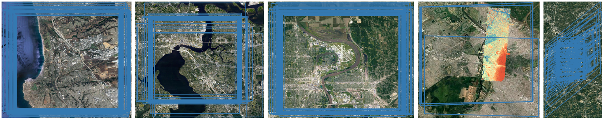
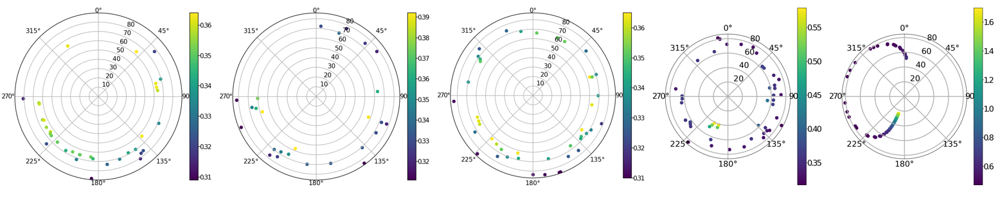

# Stellar: A Large Satellite Stereo Dataset for Digital Surface Model Generation
This repository provides instructions and download links for the Stellar dataset. It contains stereo rectified stereo pairs and the ground truth disparity is adjusted to unipolar using SRTM DEM. Additionally we also provide access to ground truth Lidar Digital Surface Model (DSM) where the vertical datum is adjusted to WGS84 ellipsoid. If you use this dataset and code in your work, please kindly cite the following paper:

```
@Article{isprs-archives-XLVIII-M-1-2023-433-2023,
AUTHOR = {Patil, S. and Guo, Q.},
TITLE = {STELLAR: A LARGE SATELLITE STEREO DATASET FOR DIGITAL SURFACE MODEL GENERATION},
JOURNAL = {The International Archives of the Photogrammetry, Remote Sensing and Spatial Information Sciences},
VOLUME = {XLVIII-M-1-2023},
YEAR = {2023},
PAGES = {433--440},
URL = {https://isprs-archives.copernicus.org/articles/XLVIII-M-1-2023/433/2023/},
DOI = {10.5194/isprs-archives-XLVIII-M-1-2023-433-2023}
}
``` 

Stellar ground truth DSM covers five regions in north and south America. The following figure shows Stellar coverage as compared to the existing datasets. From left to right (a) San Diego, California, (b) Jacsonvile, Florida (c) Omaha, Nebraska (d) San Fernando, Argentina (e) Atlanta, Georgia.



Corresponding satellite image coverage is shown below. Each polygon is coverage of one satellite image. Note that only in Argentina Lidar coverage is smaller than the satellite coverage. 



Being multi-date and multi-view images the satellite positions play role in stereo pair selection. The following plot show satellite position distribution for each region.  Note that WoldView2 images are available in Atlanta region therefor it has different resolution (see colorbar) as compared to the other regions.


We are currently preparing release of the Stellar dataset. The dataset is >300 GB and we're planning to release it in the following three parts 

TODO 
- [ ] Stereo pairs with ground truth disparity maps (Download links coming soon)
- [ ] Unified Lidar DSM with semantic labels (where available) (Download links coming soon)
- [ ] Utility scripts to process the dataset which will be available in this repository.  